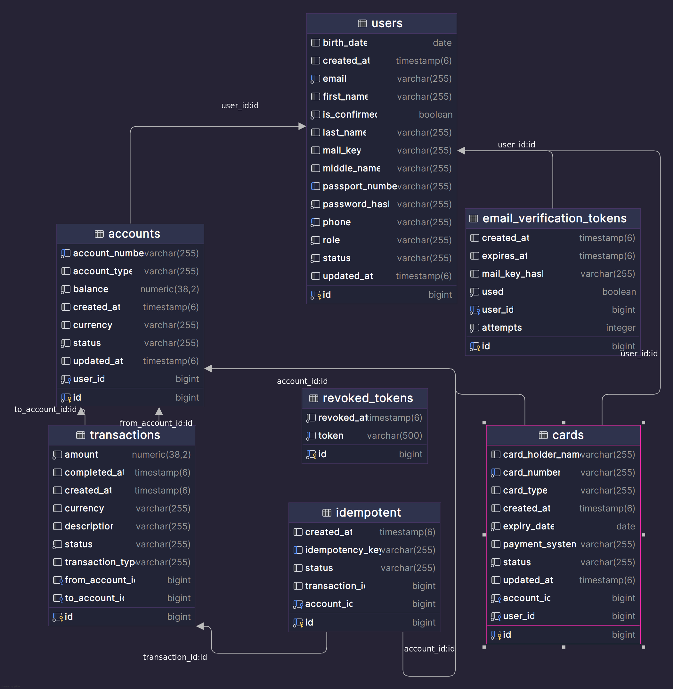

<a id="readme-top"></a>

## Table of Contents

- [About the Project](#about-the-project)
  - [Tech Stack](#tech-stack)
  - [Features](#features)
- [Getting Started](#getting-started)
  - [Prerequisites](#prerequisites)
  - [Installation and Launch](#installation-and-launch)
- [Usage](#usage)
- [Configuration](#configuration)
- [Architecture and Kafka Integration](#architecture-and-kafka-integration)
- [API Overview](#api-overview)
- [Testing](#testing)
- [CI](#ci)
- [Database Schema](#database-schema)
- [Load Testing (k6)](#load-testing-k6)
- [Contact](#contact)

---

## About the Project

**BankSystem** is a Spring Boot application for the banking domain with JWT authentication, PostgreSQL integration, email service, and a simple frontend. The project is also designed for convenient local launch and containerization.

<p align="right">(<a href="#readme-top">back to top</a>)</p>

---

## Tech Stack


<p align="right">(<a href="#readme-top">back to top</a>)</p>

---

## Features

- Idempotency for transactions via `Idempotency-Key` header + auto-cleanup of old records

---

## Getting Started

### Prerequisites

- **Java 21**
- **Docker** and **Docker Compose** (for containerized launch)
- **PostgreSQL** (if running without Docker)

### Installation and Launch

1. Copy the environment example:
   ```bash
   cp .env.example .env
   ```
2. Fill in the variables in `.env`.
3. Choose a launch scenario.

#### Locally (without Docker)

1. Ensure PostgreSQL is running.
2. Specify the local database URL, for example:
   ```
   DB_URL=jdbc:postgresql://localhost:5432/bank_db
   ```
3. Run the application:
   ```bash
   ./gradlew bootRun
   ```

#### Via Docker Compose

```bash
docker compose up --build
```

<p align="right">(<a href="#readme-top">back to top</a>)</p>

---

## Usage

- The application will be available at: [http://localhost:8080](http://localhost:8080)
- PostgreSQL is exposed on `localhost:5432` *(if the port is free)*
- You can navigate to the HTML page for general information at [http://localhost:8080](http://localhost:8080)
- The project has `RateLimiterFilter` with a limit of **50 tokens per minute**

<p align="right">(<a href="#readme-top">back to top</a>)</p>

---

## Configuration

The application uses a `.env` file, automatically picked up via `spring.config.import: optional:file:.env[.properties]`.

- CORS is configured for the dev scenario (when frontend runs separately) and is enabled via the `dev` profile
- The project uses Spring Profiles: `dev`, `test`, `prod`. The active profile is set via `SPRING_PROFILES_ACTIVE`

| Variable | Description |
|---|---|
| `JWT_SECRET` | Secret for JWT token signing |
| `JWT_EXPIRATION` | Token lifetime (ms) |
| `DB_URL` | JDBC URL to PostgreSQL |
| `DB_USERNAME` / `DB_PASSWORD` | Database login/password |
| `POSTGRES_DB` / `POSTGRES_USER` / `POSTGRES_PASSWORD` | Postgres container settings |
| `EMAIL_USERNAME` / `EMAIL_PASSWORD` | SMTP credentials (example — Gmail) |
| `SPRING_PROFILES_ACTIVE` | Active Spring profile (`dev`/`test`/`prod`) |

<p align="right">(<a href="#readme-top">back to top</a>)</p>

---

## Architecture and Kafka Integration

**BankSystem** is part of an event-driven architecture and interacts with an external AI service via **Apache Kafka**. This allows separating service responsibilities, ensuring asynchronous request processing, and increasing system fault tolerance.

### Message Flow

```
User → BankSystem → Kafka → AI Assistant → Kafka → BankSystem
```

1. BankSystem sends user requests to Kafka
2. AI Assistant consumes messages and performs processing
3. Response is returned back via Kafka
4. BankSystem receives the result and completes the operation

### Kafka Topics

| Topic | Purpose |
|---|---|
| `ai_messages` | Requests from BankSystem to AI service |
| `ai_answers` | AI service responses back to BankSystem |

The AI assistant is implemented as a separate microservice:
**[AI Assistant Project](https://github.com/favian1967/Ai_Assistant)**

### Kafka Local Launch

For interaction between services, a locally running Kafka broker is required.

Single-node Kafka launch:

```bash
docker run -d \
  --name main_bank_kafka \
  -p 9092:9092 \
  -e KAFKA_NODE_ID=1 \
  -e KAFKA_PROCESS_ROLES=broker,controller \
  -e KAFKA_LISTENERS=PLAINTEXT://0.0.0.0:9092,CONTROLLER://:9093 \
  -e KAFKA_ADVERTISED_LISTENERS=PLAINTEXT://localhost:9092 \
  -e KAFKA_CONTROLLER_LISTENER_NAMES=CONTROLLER \
  -e KAFKA_CONTROLLER_QUORUM_VOTERS=1@localhost:9093 \
  -e KAFKA_LOG_DIRS=/tmp/kraft-combined-logs \
  -e KAFKA_OFFSETS_TOPIC_REPLICATION_FACTOR=1 \
  apache/kafka:latest
```

<p align="right">(<a href="#readme-top">back to top</a>)</p>

---

## API Overview

### Authentication
```
POST /api/auth/register
POST /api/auth/login
POST /api/auth/logout
POST /api/auth/send
```

### Accounts
```
POST   /api/accounts/add
GET    /api/accounts/getById/{id}
GET    /api/accounts/{id}/balance
PATCH  /api/accounts/{id}/status
DELETE /api/accounts/{id}/close
```

### Cards
```
POST /api/cards/createCard
GET  /api/cards/getMyCards
POST /api/cards/block/{id}
POST /api/cards/unblock/{id}
```

### Transactions
```
POST /api/transactions/deposit
POST /api/transactions/withdraw
POST /api/transactions/transfer
```

> The project also contains other less significant endpoints that can be found in Controllers.

<p align="right">(<a href="#readme-top">back to top</a>)</p>

---

## Testing

```bash
./gradlew test
```

Tests use **Testcontainers**, so Docker installation is required.

<p align="right">(<a href="#readme-top">back to top</a>)</p>

---

## CI

The project has **GitHub Actions CI** configured: on every push/PR, `./gradlew test` is automatically executed in the `test` profile.

<p align="right">(<a href="#readme-top">back to top</a>)</p>

---

## Database Schema



<p align="right">(<a href="#readme-top">back to top</a>)</p>

---

## Load Testing (k6)

Basic load testing was performed using **k6** to evaluate API performance under concurrent load.

### Scenario

- Endpoint: `/api/accounts/getAll`
- Auth via JWT (token reused)
- Each user: request → `sleep(1)`

### Results

| Load | Behavior |
|---|---|
| ≤ 60 users (~60 RPS) | Stable, fast response (~10–30 ms) |
| ≥ 70 users | Noticeable latency growth |
| 100+ users | Significant delays (seconds) |

### Conclusion

The system handles ~60 requests/sec per instance comfortably. Beyond this point, performance degrades due to resource saturation (DB / connection pool / threads).

### Run test

```bash
k6 run test.js
```

<p align="right">(<a href="#readme-top">back to top</a>)</p>

---

## Contact

**Project Author:** tg — [@Rafink](https://t.me/Rafink) · x — [Favian4747](https://x.com/Favian4747)

**Project Link:** [https://github.com/favian1967/BankSystem](https://github.com/favian1967/BankSystem)

<p align="right">(<a href="#readme-top">back to top</a>)</p>
